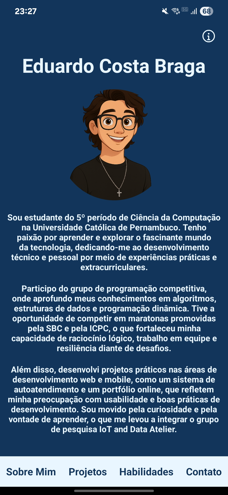
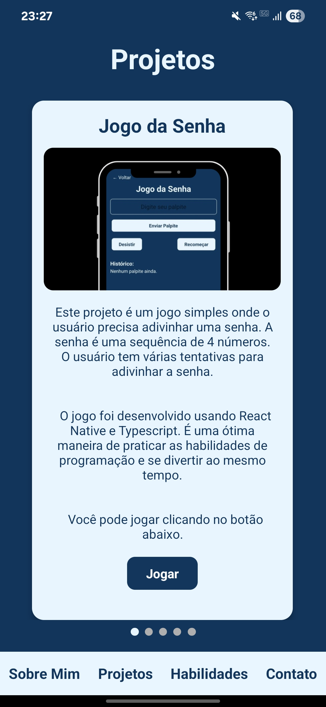
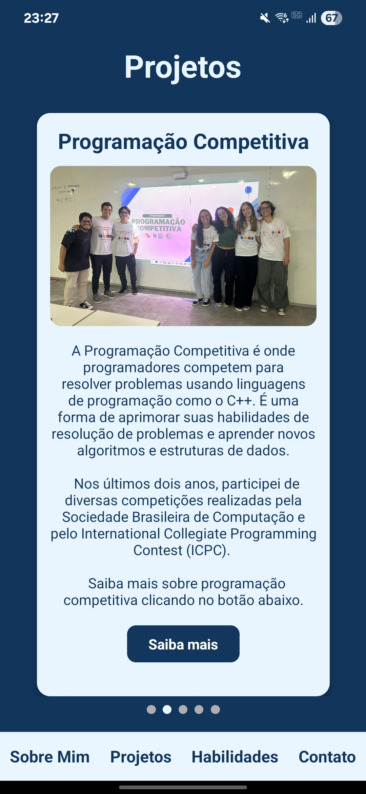
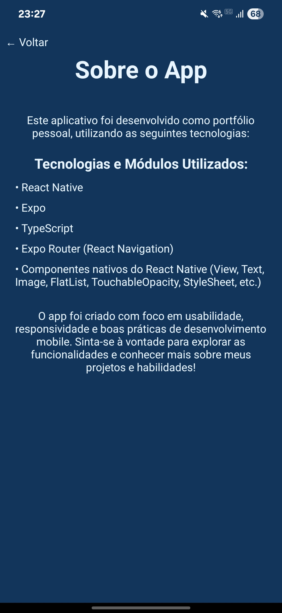

# Portfólio Mobile

Este é um aplicativo de portfólio pessoal desenvolvido em React Native com Expo, criado como projeto individual para a disciplina de Programação Web e Mobile.

## ✨ Funcionalidades

- Apresentação pessoal e trajetória acadêmica
- Exibição de projetos desenvolvidos, com imagens e links
- Exibição de projetos de extensão (Experiência Acadêmica)
- Lista de habilidades técnicas e ferramentas conhecidas
- Lista de habilidades técnicas e ferramentas utilizadas no desenvolvimento desse projeto
- Contato via redes sociais
- Jogo interativo de adivinhação de senha

## 📱 Screenshots

### Tela Inicial
<div style="display: flex; gap: 10px;">
  
</div>

### Tela de Projetos Desenvolvidos e Participados
<div style="display: flex; gap: 10px;">
  
  
</div>

### Tela Sobre o App com Tecnologias Utilizadas

<div style="display: flex; gap: 10px;">
  
</div>

## 💻 Como rodar o projeto

1. Clone este repositório:
   ```bash
   git clone https://github.com/Dudubraga/Portfolio-Mobile.git
   cd Portfolio-Mobile/portfolio
   ```

2. Instale as dependências:
   ```bash
   npm install
   ```

3. Inicie o app:
   ```bash
   npx expo start
   ```
   
## 📦 Download do APK

Baixe o APK mais recente [aqui](https://github.com/Dudubraga/Portfolio-Mobile/releases).

---

Projeto desenvolvido por **Eduardo Costa Braga**.